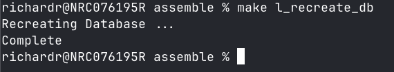
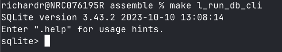
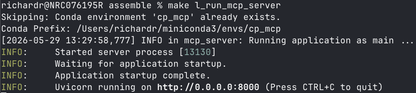
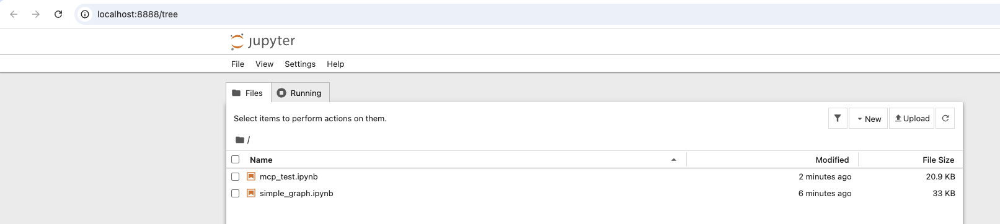
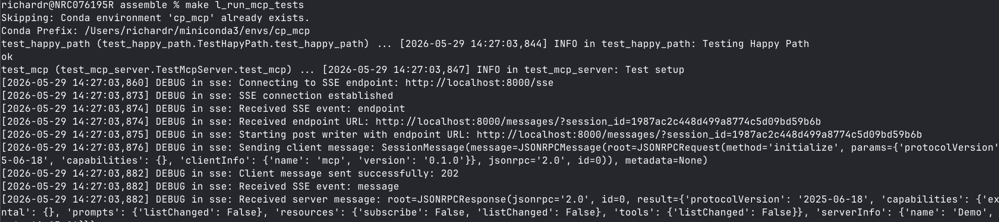
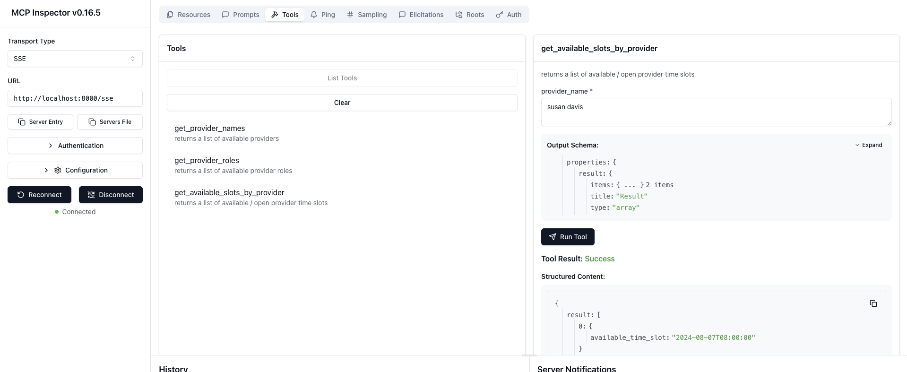

# Purpose

- MCP server used to share tools remotely
- Available tools :
   - get_provider_names - returns a list of available providers
   - get_provider_roles - returns a list of available provider roles
   - get_available_booking_slots_for_provider - returns a list of available / open provider time slots
   - book_slot_for_provider - books client appoinment with provider at specified time slot
   - list_booked_appointments_for_client - Returns a list of booked appointments for a client

# General Setup and Usage Instructions

The instructions assume that you are in the `<project root>/mcp` directory.
They have been tested and validate on a Mac M2.

- Setting up the sqlite3 database (Assumes sqlite3 is already installed as is the case on a Mac.)
~~~
<new terminal window>
cd ./util_scripts
sh init_db.sh
~~~
- This will create and populate the database. Only run this once.
- When the databaes is ready, you should see something like this in your terminal :

- There is a `cli.sh` file in the `./util_scripts` directory that can be used to connect to the database using the command-line interface
- Running the command-line interface is optional
- When run, you can issue SQL queries interactively. When the `cli.sh` script is run, you should see something like this in your terminal:

- Run following commands to setup the conda environment with python 3.13.3
~~~
<new terminal window>
cd ./src
conda create -n mcp-server python=3.13.3
conda activate mcp-server
pip install -r requirements.txt
pip install aiosqlite
~~~

- Start the MCP server
~~~
python main.py
~~~
- When the MCP server script is run, you should see something like this in your terminal:

- If you want to test the mcp server with Jupyter
~~~
<new terminal window>
conda activate mcp-server
jupyter notebook
~~~
- Note books will be located in `./src/jupyter

- If you want to run the unit tests,
- Note that the MCP server and the pg-vector docker container must be running for the tests to pass
~~~
<new terminal window>
conda activate mcp-server
cd ./util_scripts
sh run_unit_tests.sh
~~~
- When running the unit tests, your terminal should look like this:

- If you want to run the MCP inspector:
~~~
<new terminal window>
conda activate mcp-server
cd ./util_scripts
sh start_inpector.sh
~~~
- The GUI for the inspector should look like this:

- Note that the MCP server and the pg-vector docker container must be running in order to interact with the tools using the inspector

- Note that the inspector needs `npm` and `nodejs`. These can be installed with brew.
